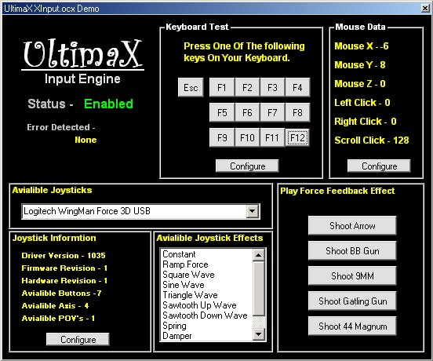



## DirectInput8 Control

### Description

This control handles almost every aspect of DirectInput8, if not all! It handles the usual mouse and keyboard events, but it also supports joysticks with force feedback and regular joysticks. Also you can configure the devices (mouse, keyboard, and joystick) from within the code. It opens the Configuration Window. Has some sample force feedback effects I made to so you can test your joystick. I pulled this out of my new engine and I thought I would share it with everyone. Enjoy It. VERY EASY TO USE and comes with a demo.
 
### More Info
 

             |
---                |---
**Submitted On**   |2002-05-19 18:27:38
**By**             |[James Dougherty](https://github.com/Planet-Source-Code/PSCIndex/blob/master/ByAuthor/james-dougherty.md)
**Level**          |Intermediate
**User Rating**    |4.9 (44 globes from 9 users)
**Compatibility**  |VB 6\.0
**Category**       |[DirectX](https://github.com/Planet-Source-Code/PSCIndex/blob/master/ByCategory/directx__1-44.md)
**World**          |[Visual Basic](https://github.com/Planet-Source-Code/PSCIndex/blob/master/ByWorld/visual-basic.md)
**Archive File**   |[DirectInpu849555192002\.zip](https://github.com/Planet-Source-Code/james-dougherty-directinput8-control__1-34939/archive/master.zip)

